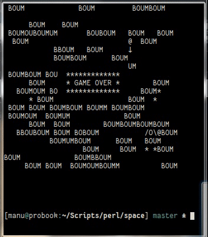

# Space - un jeu dans l'espace intersidéral

## Pourquoi ce programme

J'écris ce programme pour apprendre à la fois la programmation mais aussi Perl.
Pour l'instant écrit en procédural, je compte découvrir la POO avec ce jeu.
Et en plus c'est rigolo.

## C'est quoi Space

Space est un jeu ASCII dans une scène de 20 lignes par 30 colonnes.

Space est un jeu dans lequel vous contrôlez un vaisseau spatial. Vous devez
éviter les obstacles et les ennemis, tout en chassant les bonus.

Vous déplacez votre vaisseau avec les touches fléchées, il peut reculer, et
quand il sort sur un bord il revient de l'autre côté.

Le score dépend a la fois du temps écoulé (aller vite rapporte plus) et du
nombre de bonus capturés.

## Screencast

## Licence
Ce travail est placé sous double licences [WTFPL](http://www.wtfpl.net/ "wtfpl.net")/[LPRAB](http://sam.zoy.org/lprab/ "Sam Hocevar") et Beerware ([fr](https://fr.wikipedia.org/wiki/Beerware "wikipedia")) ([en](https://en.wikipedia.org/wiki/Beerware "wikipedia"))

Vous pouvez bien faire ce que vous voulez de ces lignes de code, vous n'êtes
pas obligé de me citer. Par contre si l'envie vous prends de m'offrir une
limonade ou quelques satoshis, à votre bon cœur :)

Bitcoin 1KhkC6U27B9fdzk4qiAF96RK4vpUGPbN7Z

Ether 0x02a611f0c15bccdb6fa8e5e4b0692ff6d77852bd

Litecoin LZz6RCcX8VXznwR4xdjdKLyAhEvB2Y2T8B

Doge DB4D3qwcWj6V6GHjeP88So1TC1SFhbSAfx
